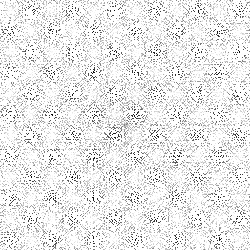

# Ulam Spiral Visualization

<p align="center">
  
</p>

`uspiral` is a Linux only command line tool that visualizes the [Ulam
Spiral][1]. The visualization is a PNG whose white pixels represent composite
numbers and whose black pixels represent prime numbers.

### Building

Included is a build script that supports a number of command line options:

```text
build ulam spiral visualizer
usage: build.sh [OPTION]...
options:
	-g    enable debug info
	-t    build unit tests
	-d    build doxygen docs
	-h    print this help message
```

You will need the following libraries and tools to build:

* CMake3.16+
* C++ compiler supporting C++20 features
* libpng developer libraries
* zlib developer libraries
* Boost version 1.76.0+
* [Doxygen][2]

To build, run the `build.sh` script with arguments of your choosing. For
example, to build the application, Doxygen docs, and unit tests:

```bash
cd ulam_spiral/scripts
./build.sh -d -t
```

Build artefacts install to the following locations:

* Binaries: `ulam_spiral/bin`
* Doxygen Docs: `ulam_spiral/docs/html`
* Unit Tests: `ulam_spiral/build`

### Program Usage 

Running `uspiral -h` displays the program usage message:

```text
usage: uspiral [OPTION]... IMAGE
visualize the Ulam spiral
	IMAGE
		output png filepath
	-d, --dimension DIM
		square matrix dim (default 201)
	-h, --help
		print this help page
```

You can produce a Ulam Spiral of any dimension. The dimension is controlled by
the `--dimension DIM` option. The output of the program is always a PNG with
length/width equal to `DIM`. For example,

```bash
./uspiral -d 1024 spiral.png
```

Produces a 1024x1024 Ulam Spiral image. The black pixels in the image are the
prime numbers. The white pixels are the composite numbers.

### Unit Testing

Included in this repo are number of GoogleTest unit tests. Follow the steps
below to build and run the unit tests:

1. Change directory to `ulam_spiral/scripts/`.

2. Run the build script with the `-t` option:
```bash
./build.sh -t
```

3. Change directory to `ulam_spiral/build/`.

4. Run CTest:
```bash
ctest
```

### Doxygen Docs 

Project source is documented using Doxygen. To build the docs, follow these
steps:

1. Change directory to `ulam_spiral/scripts/`.

2. Run the build script with the `-d` option:
```bash
./build.sh -d
```

3. Open `ulam_spiral/docs/html/index.html` in your browser.

[1]: https://en.wikipedia.org/wiki/Ulam_spiral#
[2]: https://www.doxygen.nl/
